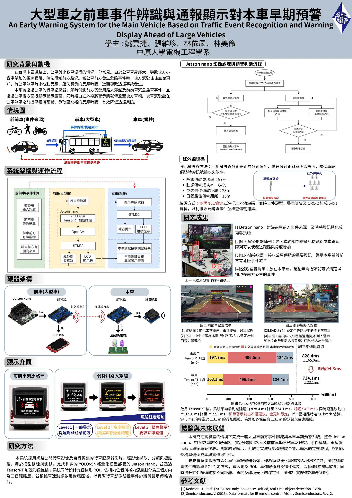

# 大型車之前車事件辨識與通報顯示對本車早期預警

**Large-Vehicle-Ahead Event Warning System**

> 團隊專題｜我的負責部分：弱勢用路人事件判定、TensorRT 加速與 Jetson Nano 部署

## 專題簡介

當後車視線被公車等大型車遮蔽時，駕駛無法看到大型車前方的突發狀況。本系統在大型車煞車之前即辨識前方危險事件，並通報顯示給後車，爭取更早的反應時間。

## 我的負責部分

### 1. 弱勢用路人（VRU）事件判定

- 於行車路徑建立**梯形 3×3 九宮格 ROI**
- 以 OCR 讀取車速，結合偵測目標落在 ROI 的位置，決定警示等級
- 物件偵測使用預訓練之交通物件模型（YOLOv5n）

### 2. 推論加速與邊緣部署

- 以 TensorRT / torch2trt 加速模型推論：約 **15 → 35 FPS**
- 部署於 Jetson Nano（CUDA）

## 成果

| 競賽 | 成績 |
| --- | --- |
| 115 年中國工程師學會學生分會工程論文競賽 | 入圍 |
| 2026 全國大專院校智慧創新暨跨域整合創作競賽 | 參賽 |

## 海報

## 文件

| 文件 | 說明 |
| --- | --- |
| [期末專題報告](docs/期末專題報告.pdf) | 中原大學電機系期末專題報告 |
| [研討會海報](docs/研討會海報.pdf) | 海報 PDF 版 |
| [競賽企劃書](docs/智慧創新競賽企劃書.pdf) | 2026 全國大專校院智慧創新暨跨域整合創作競賽 |
| [系統需求書](docs/智慧創新競賽系統需求書.pdf) | 2026 全國大專校院智慧創新暨跨域整合創作競賽 |
