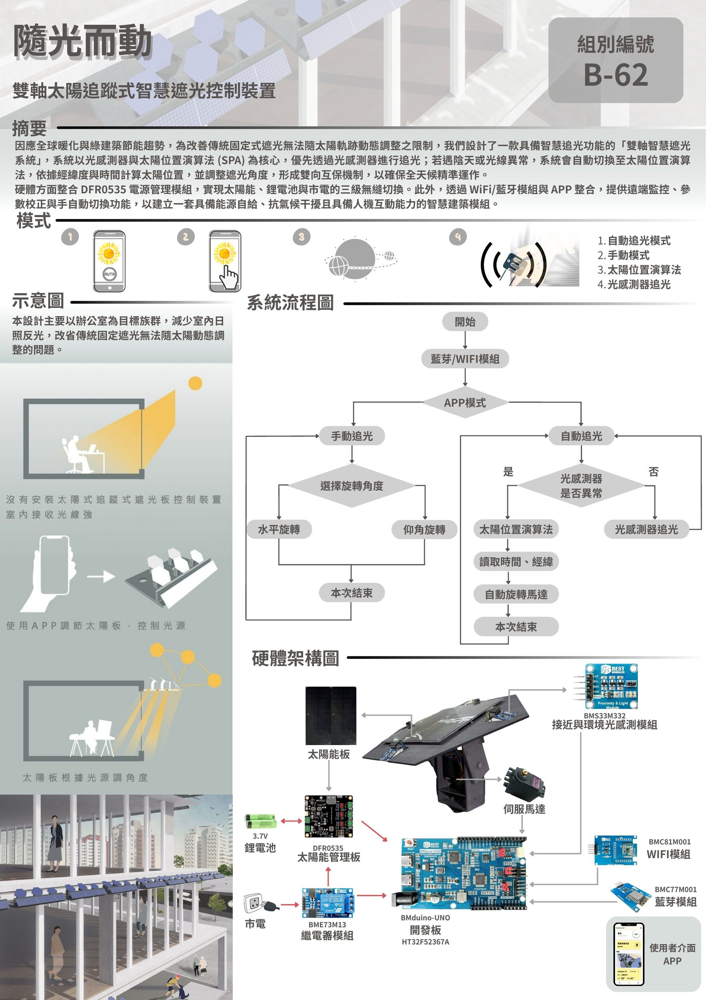

# 太陽追蹤式遮光板控制裝置

**Smart Sun-Tracking Shade**

> 團隊專題｜我的負責部分：光感測器追光

## 專題簡介

本專題開發一套雙軸太陽追蹤式遮光板控制系統，以 HT32F52367A 微控制器為核心，透過光感測器偵測光強度差值驅動伺服馬達追蹤太陽，感測異常時切換為太陽位置演算法（SPA）備援。供電採太陽能優先、電池備援、市電保障三級切換，整合手機 App 提供即時控制，兼顧遮陽採光與節能效益。

## 我的負責部分：光感測器追光

- 感測器配置：在沒有物理隔板的情況下，將左右感測器各朝外偏轉 20°，靠角度差讓兩側接收到明顯不同的光強度
- 追光演算法：不用兩側的絕對差值，而是計算差值比例 Ratio =（右 − 左）/（右 + 左）。無論晴天或陰天，只要光線偏離角度相同，算出的比例就相同，讓系統在任何天氣下的靈敏度都一致
- 閉環控制：每次微調後都重新讀取感測器並計算比例，持續修正直到落入死區（0.015）內才停止，避免馬達在平衡點附近來回抖動
- 硬體平台：HOLTEK HT32F52367A / BMduino

## 成果

| 競賽 / 發表 | 成績 |
| --- | --- |
| 第 20 屆盛群盃 HOLTEK MCU 創意大賽 | 金獎 |
| 跨域創意整合設計獎 | 第二名 |
| 微星盃創意構想類 | 銅獎、人氣獎 |
| 為桃園做研究 | 潛力研究獎 |
| 物業管理研討會 | 論文入圍發表 |
| Panasonic 綠色生活創意大賽 | 參賽 |

## 海報

## 文件

| 文件 | 說明 |
| --- | --- |
| [盛群盃複賽報告書](docs/盛群盃複賽報告書.pdf) | 第 20 屆盛群盃 HOLTEK MCU 創意大賽複賽報告 |
| [物業管理研討會論文](docs/物業管理研討會論文.pdf) | 2026 第 19 屆物業管理研究成果發表會論文 |
| [盛群盃海報](docs/盛群盃海報.pdf) | 海報 PDF 版 |
