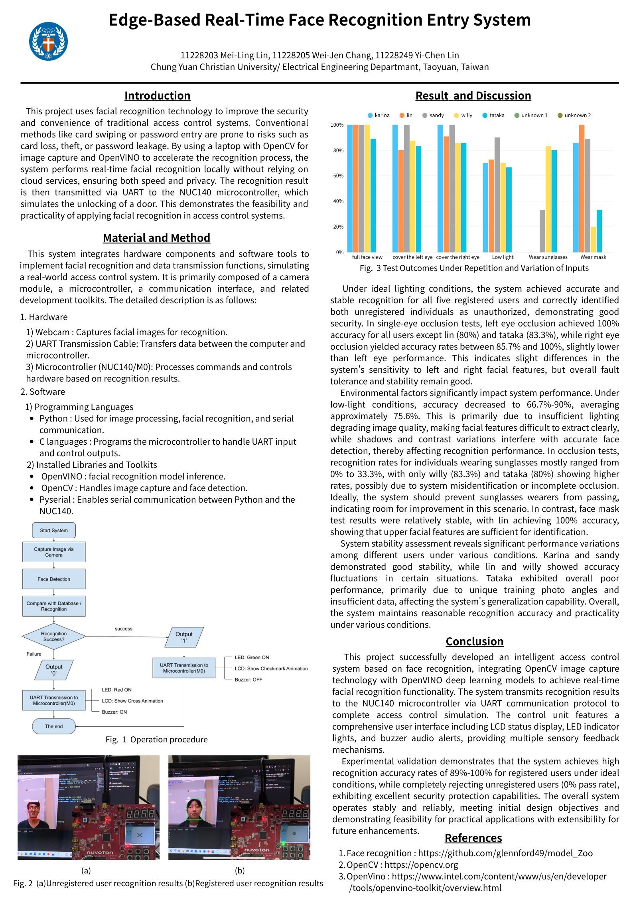

# Edge-Based Real-Time Face Recognition Entry System

**邊緣運算即時人臉辨識門禁系統**｜產業創新課程專題｜組員：林美伶、張維珍、林依辰

## 專題簡介

以人臉辨識取代刷卡、密碼等傳統門禁方式，改善卡片遺失或密碼外洩的風險。系統於筆電端以 OpenCV 擷取影像、OpenVINO 加速辨識推論，全程在本地運算、不依賴雲端，兼顧速度與隱私；辨識結果透過 UART 傳送至 NUC140 微控制器，模擬門鎖開啟。

## 系統流程

攝影機擷取影像 → 人臉偵測 → 與資料庫比對 → 辨識結果經 UART 傳至 NUC140

- **辨識成功**：綠燈亮、LCD 顯示打勾動畫
- **辨識失敗**：紅燈亮、LCD 顯示叉號動畫、蜂鳴器響

## 實驗結果

- 理想光線下，已註冊使用者辨識準確率達 89%–100%，未註冊者通過率為 0%
- 單眼遮蔽情況下仍維持良好辨識能力
- 低光源、配戴口罩或墨鏡時準確率下降，其中墨鏡情境影響最大，為後續改善方向

## 使用技術

| 類別 | 內容 |
| --- | --- |
| 影像辨識 | OpenCV、OpenVINO |
| 程式語言 | Python（影像處理、序列通訊）、C（微控制器） |
| 嵌入式 | Nuvoton NUC140（Cortex-M0）、LED、LCD、蜂鳴器 |
| 通訊 | UART、PySerial |

## 文件

- [論文（PDF）](Face_Recognition_Entry_System_Paper.pdf)
- 海報：

